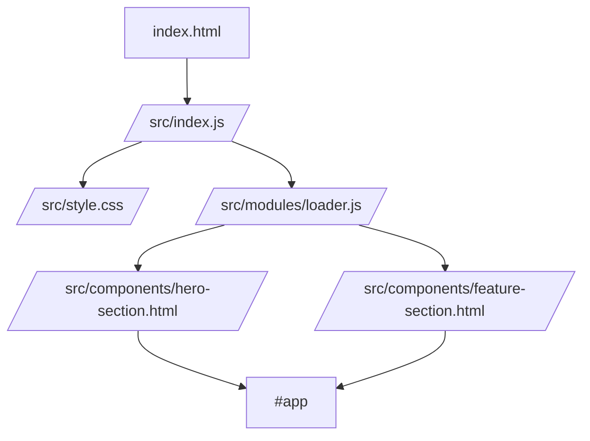

# frontend-vite-starter

A clean **Vite + Tailwind + semantic HTML** starter template for learning projects.

## Why this template exists

This template is intentionally simple:

- no framework
- no unnecessary tooling
- semantic HTML first
- CSS that is readable and easy to extend
- structure that supports `components/` + `modules/`

It is a good fit for:

- frontend homework
- semantic HTML practice
- Tailwind experiments
- ESM practice
- small landing pages
- component-based static pages

---

## Project structure

```text
frontend-vite-starter/
├── index.html
├── vite.config.js
├── package.json
├── .gitignore
└── src/
    ├── index.js
    ├── style.css
    ├── components/
    │   ├── hero-section.html
    │   └── feature-section.html
    └── modules/
        └── loader.js
```

---

## Architecture idea



### How it works

1. `index.html` provides the page shell.
2. `src/index.js` imports `style.css`.
3. `src/index.js` loads HTML components with `loadComponent()`.
4. The loaded components are injected into `#app`.
5. `style.css` provides reset, base layout, component styles, and reusable layout references.

---

## Quick start

### 1. Install dependencies

```bash
npm install
```

### 2. Start development server

```bash
npm run dev
```

### 3. Build for production

```bash
npm run build
```

### 4. Preview production build

```bash
npm run preview
```

---

## What each file does

### `index.html`

- page shell
- `header`, `main`, `footer`
- includes `/src/index.js`

### `src/index.js`

- app entry
- imports `style.css`
- loads components
- appends them into `#app`

### `src/modules/loader.js`

- fetches HTML fragments
- converts them into DOM nodes
- returns cloned content

### `src/style.css`

Contains four parts:

1. **Reset**
2. **Base**
3. **Components**
4. **Utilities / references**

### `src/components/*.html`

These are semantic HTML fragments such as:

- `hero-section.html`
- `feature-section.html`

You can keep expanding this folder with files like:

- `nav-section.html`
- `about-section.html`
- `contact-section.html`
- `faq-section.html`

---

## Recommended workflow

### Base page

Use the base HTML shell for:

- unknown project direction
- first setup
- quick starting point

### Section components

Add section files when the layout starts growing.

Example:

- `hero-section.html`
- `features-section.html`
- `gallery-section.html`

### CSS strategy

A practical order:

```css
/* 1. reset */
/* 2. base / variables */
/* 3. layout */
/* 4. components */
/* 5. utilities */
```

---

## When to use Flex and Grid

### Use Flex when the layout is one-dimensional

Best for:

- navbar rows
- button groups
- aligning items in one row
- stacking content in one column
- wrapping tags or pills

Typical idea:

```css
.header-bar {
  display: flex;
  justify-content: space-between;
  align-items: center;
}
```

### Use Grid when the layout is two-dimensional

Best for:

- card layouts
- sidebar + content
- galleries
- evenly spaced content blocks
- multi-column sections

Typical idea:

```css
.feature-list {
  display: grid;
  grid-template-columns: repeat(auto-fit, minmax(min(100%, 15rem), 1fr));
  gap: 1rem;
}
```

### Simple rule

- **one line** → `flex`
- **a whole layout / matrix** → `grid`

---

## How to extend this starter

### Add a new component

1. create a new file in `src/components/`
2. write semantic HTML
3. add styles to `src/style.css`
4. load it in `src/index.js`

Example:

```js
const [hero, feature, faq] = await Promise.all([
  loadComponent('/src/components/hero-section.html'),
  loadComponent('/src/components/feature-section.html'),
  loadComponent('/src/components/faq-section.html'),
]);

app.append(hero, feature, faq);
```

---

## Suggested naming

For your own snippets and project templates:

- `h5Base` → minimal page shell
- `h5Section` → single semantic section
- `h5CardList` → section with cards
- `h5Starter` → fuller starter page

For the project template itself:

- **`frontend-vite-starter`**

That name is clearer than just `vite`, because it says both the domain and the purpose.

---

## Submission-friendly advantages

This structure looks good in homework and presentations because it shows:

- semantic HTML awareness
- modular thinking
- clean separation of structure / style / behavior
- readable folder organization
- responsive design basics

---

## Next upgrade ideas

You can evolve this template into:

- `frontend-vite-starter-plus`
- `h5-react-starter`
- `frontend-api-starter`

Possible future additions:

- `data/` folder
- `render.js`
- API fetch module
- localStorage module
- reusable card renderer
- project README template
- Trello / Figma / presentation notes
